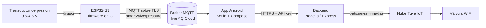

# Smart Valve IoT (Válvula inteligente)

[](https://github.com/valdemar-ortega/smart-valve-iot/actions/workflows/ci.yml)

Monitoreo remoto de presión y control de una válvula desde un celular Android.

Un **ESP32-S3** lee un transductor de presión analógico y publica el valor
por **MQTT/TLS**. Una **app Android** lo muestra en vivo y abre o cierra una
**válvula WiFi Tuya** a través de un pequeño **backend en Node.js**, que
mantiene las credenciales de la nube fuera del celular.

*[Read in English](README.md)*



## Dos versiones del firmware

| Carpeta | Tecnología | Estado |
|---|---|---|
| [`firmware-arduino/`](firmware-arduino) | Arduino, PlatformIO, PubSubClient | **Prototipo probado en campo.** Corrió en la instalación real con la válvula y el sensor |
| [`firmware/`](firmware) | ESP-IDF 5.4, C puro, FreeRTOS | **Port del prototipo**, con las mejoras de abajo. Compila en la CI y su lógica tiene pruebas unitarias; aún no se ha corrido en hardware |

Las dos publican el mismo JSON en los mismos topics, así que la app y el
backend funcionan con cualquiera.

**Qué mejora el port:** verifica el certificado TLS del broker (el
prototipo cifra pero no lo verifica), convierte el ADC con la calibración
de fábrica del chip (eFuse) en vez de una referencia nominal de 3.3 V, se
reconecta al WiFi por eventos con reintentos exponenciales, toma toda la
configuración de `menuconfig` y separa la conversión voltaje → presión en
un módulo de C puro con pruebas unitarias.

## Qué incluye

- **Firmware en C sobre ESP-IDF 5.4.** WiFi por eventos con reintentos
  exponenciales, TLS que verifica el certificado del broker, Last Will que
  avisa cuando la placa se desconecta y lecturas del ADC calibradas
  (curva de eFuse, promedio, detección de cable abierto y cortocircuito).
  El muestreo nunca se bloquea por la red.
- **La conversión voltaje → presión tiene pruebas unitarias.** No depende
  del hardware y corre en la PC, con ASan y UBSan en la CI.
- **App Android en Kotlin + Jetpack Compose.** MVVM con StateFlow, cliente
  MQTT 5, Retrofit, medidor en vivo e interfaz en inglés y español.
  Las pruebas unitarias cubren el ViewModel y el contrato JSON con el
  firmware.
- **Backend.** Guarda el secreto de Tuya en el servidor, compara la API key
  en tiempo constante, se despliega en Render con un clic y tiene pruebas
  con un cliente Tuya falso.
- **Ninguna credencial va en el código.** Todas viven en archivos que git
  ignora.

## Estructura

```
firmware/          Proyecto ESP-IDF (C) para el ESP32-S3
  main/              app_main, wifi_sta, pressure_sensor, pressure_math, mqtt_link
  test/              pruebas unitarias en la PC (make)
firmware-arduino/  Prototipo en Arduino (PlatformIO), la versión probada en campo
android/    Proyecto de Android Studio (Kotlin, Jetpack Compose)
backend/    Servicio Node.js entre la app y la nube de Tuya
docs/       hardware.md (conexiones, calibración) · protocol.md (MQTT + REST)
```

## Qué necesitas

| | |
|---|---|
| Hardware | ESP32-S3-DevKitC-1, transductor de presión de 0.5–4.5 V, resistencias de 1 kΩ y 2 kΩ, válvula WiFi Tuya/Smart Life. Ver [docs/hardware.md](docs/hardware.md) |
| Cuentas (el plan gratis alcanza) | [HiveMQ Cloud](https://www.hivemq.com/mqtt/cloud-broker/) (o cualquier broker MQTT con TLS), [Tuya IoT Platform](https://iot.tuya.com), [Render](https://render.com) (o cualquier hosting de Node) |
| Software | [ESP-IDF v5.4](https://docs.espressif.com/projects/esp-idf/en/v5.4.2/esp32s3/get-started/index.html), [Android Studio](https://developer.android.com/studio), [Node.js 18+](https://nodejs.org) |

---

## Guía de instalación

Sigue los pasos en orden: cada uno te da un dato que el siguiente necesita.
Ten un archivo de texto abierto para apuntarlos.

### 1. Broker MQTT (HiveMQ Cloud)

1. Crea un clúster *Serverless* gratis en <https://console.hivemq.cloud>.
2. En **Overview**, copia el **Cluster URL**
   (`xxxxxxxx.s1.eu.hivemq.cloud`). El puerto es **8883** (TLS).
3. En **Access Management**, crea un usuario y contraseña con permiso
   *Publish and Subscribe*. Puedes crear uno para la placa y otro para la
   app.

📝 Apunta el host, el usuario y la contraseña.

### 2. Proyecto en la nube de Tuya

1. Agrega la válvula a la app **Smart Life** de tu celular y comprueba que
   puedes abrirla y cerrarla desde ahí.
2. En <https://iot.tuya.com> ve a **Cloud → Development → Create Cloud
   Project**. Usa *Smart Home* y elige el **data center que corresponde a
   la región de tu cuenta de Smart Life** (por ejemplo *Western America*
   para México y EE. UU.). Equivocarse aquí es el error más común.
3. Dentro del proyecto: **Devices → Link Tuya App Account → Add App
   Account**, y escanea el código QR con Smart Life (*Yo → icono de
   escanear*). La válvula aparece en la lista de dispositivos.
4. En **Service API**, verifica que *IoT Core* esté autorizado.

📝 Apunta el **Access ID** y el **Access Secret** (en *Overview* del
proyecto), el **Device ID** de la válvula y el **endpoint** de tu data
center (`https://openapi.tuyaus.com` para Western America).

### 3. Backend

**Pruébalo primero en tu computadora:**

```bash
cd backend
cp .env.example .env        # llena los datos de Tuya e inventa una API_KEY
npm install
npm test                    # 8 pruebas, no necesita internet
npm start
```

Para generar una `API_KEY` segura:

```bash
node -e "console.log(require('crypto').randomBytes(32).toString('base64url'))"
```

Comprueba que funciona:

```bash
curl http://localhost:3000/
curl -H "x-api-key: TU_API_KEY" http://localhost:3000/valve/functions
```

La segunda llamada muestra los *data points* de la válvula. Si el
interruptor no se llama `switch`, pon el nombre correcto en `VALVE_CODE`
(muchas veces es `switch_1`). Después prueba:

```bash
curl -X POST -H "x-api-key: TU_API_KEY" http://localhost:3000/valve/open
```

**Súbelo a internet (Render):**

1. Sube tu copia del repositorio a GitHub.
2. En Render: **New → Blueprint** y elige el repositorio. Render lee
   [`render.yaml`](render.yaml) y te pide `TUYA_ACCESS_ID`,
   `TUYA_ACCESS_SECRET` y `DEVICE_ID`. También genera una `API_KEY`
   aleatoria, que puedes ver en *Environment*.
3. Cambia `TUYA_ENDPOINT` y `VALVE_CODE` si los tuyos son distintos.
4. Abre `https://<tu-servicio>.onrender.com/`. Debe responder
   `{"ok":true,...}`.

> En el plan gratis el servicio se duerme tras 15 minutos sin uso, así que
> la primera petición después de eso tarda hasta unos 50 s.

📝 Apunta la URL del backend y la `API_KEY`.

### 4. Firmware (ESP32-S3)

1. Instala ESP-IDF v5.4 ([guía oficial](https://docs.espressif.com/projects/esp-idf/en/v5.4.2/esp32s3/get-started/index.html)).
   En Linux o macOS:
   ```bash
   git clone -b v5.4.2 --recursive https://github.com/espressif/esp-idf.git ~/esp/esp-idf
   ~/esp/esp-idf/install.sh esp32s3
   . ~/esp/esp-idf/export.sh          # hazlo en cada terminal nueva
   ```
2. Conecta el sensor como indica [docs/hardware.md](docs/hardware.md).
3. Configura:
   ```bash
   cd firmware
   idf.py set-target esp32s3
   idf.py menuconfig
   ```
   Entra a **Smart Valve configuration** y llena:
   - **Wi-Fi**: nombre y contraseña de la red. El ESP32 solo usa 2.4 GHz.
   - **MQTT**: URI `mqtts://<cluster-url>:8883`, usuario y contraseña.
   - **Pressure sensor**: por ahora deja los valores por defecto.

   Pulsa `S` para guardar y `Q` para salir. Tus datos quedan en
   `firmware/sdkconfig`, que git ignora.
4. Conecta la placa por el puerto **USB** (no el *UART*), compila, graba y
   mira el registro:
   ```bash
   idf.py build flash monitor          # Ctrl+] para salir del monitor
   ```
   Deberías ver algo así:
   ```
   I (1234) wifi: got IP 192.168.1.50
   I (2345) mqtt: connected to broker
   I (4321) app: 0.0 psi | 318 mV | raw 402
   ```
5. Calibra si hace falta ([docs/hardware.md → Calibration](docs/hardware.md#calibration)).

En la consola de HiveMQ, pestaña **Web Client**, suscríbete a
`smartvalve/#`: debe llegar una lectura cada 2 segundos y `online` en el
topic de estado.

Pruebas unitarias en la PC (no necesitan la placa):

```bash
make -C firmware/test
```

#### Alternativa: el prototipo en Arduino

Si prefieres la versión Arduino, úsala **en lugar de** la de ESP-IDF (las
conexiones son las mismas):

1. Instala [PlatformIO](https://platformio.org/install) (la extensión de
   VS Code o `pip install platformio`).
2. Crea tu archivo de credenciales y llénalo:
   ```bash
   cd firmware-arduino
   cp include/secrets.example.h include/secrets.h
   ```
3. Compila, graba y abre el monitor:
   ```bash
   pio run -t upload
   pio device monitor
   ```

### 5. App Android

1. Abre la carpeta `android/` en Android Studio.
2. Crea tu archivo de credenciales:
   ```bash
   cd android
   cp secrets.properties.example secrets.properties
   ```
   Llena el host, usuario y contraseña de MQTT (paso 1), y la URL del
   backend (terminada en `/`) y la `API_KEY` (paso 3).
3. Pulsa **Run ▶** con un celular conectado (depuración USB activada) o
   un emulador. También puedes compilar desde la terminal:
   ```bash
   ./gradlew testDebugUnitTest assembleDebug
   # APK: android/app/build/outputs/apk/debug/app-debug.apk
   ```

La app muestra la presión en vivo, si la placa y el sensor están bien y el
estado de la válvula, con los botones **ABRIR** y **CERRAR**.

---

## Problemas comunes

| Síntoma | Causa probable |
|---|---|
| El registro repite `disconnected (reason 201)` | Nombre de red incorrecto, o la red es solo de 5 GHz |
| `reason 15` o `reason 204` | Contraseña de WiFi incorrecta |
| `broker refused the connection` | Usuario o contraseña de MQTT incorrectos, o el usuario no tiene permiso de publicar |
| `transport error` justo después de `got IP` | La URI no empieza con `mqtts://` o el puerto no es 8883 |
| `SENSOR FAULT: 20 mV` | Cable de señal suelto, sensor sin alimentación o divisor desconectado |
| `SENSOR FAULT: 3300 mV` | Señal en corto con 3.3 V o 5 V: revisa el cableado antes de volver a energizar |
| La presión marca un poco más de 0 en reposo | Recalibra el *cero* ([docs/hardware.md](docs/hardware.md#calibration)) |
| App: "Placa desconectada" | El firmware no está corriendo, o la app y la placa usan topics o brokers distintos |
| App: los botones de la válvula dan `401` | `backend.apiKey` de la app ≠ `API_KEY` del backend |
| Backend: `permission deny` o `No permissions` | Data center de Tuya equivocado, o la cuenta de Smart Life no está vinculada al proyecto |
| El primer comando a la válvula tarda ~50 s | El plan gratis de Render se está despertando |

## Decisiones de diseño

- **Por qué la válvula no pasa por el ESP32.** Es un dispositivo Tuya
  comercial con su propio WiFi y su propia nube, así que sigue funcionando
  (y se puede controlar) aunque el nodo del sensor esté apagado. El ESP32
  solo mide.
- **Por qué un backend para la válvula.** El *Access Secret* de Tuya
  controla todos los dispositivos del proyecto. Meterlo en el APK lo
  expondría a cualquiera que lo descomprima. El backend lo guarda, y la app
  solo recibe una clave que puedes cambiar cuando quieras.
- **Por qué MQTT para la presión.** Permite muchos suscriptores, guarda el
  último valor y detecta presencia con el Last Will, con pocos bytes por
  lectura. Consultar por HTTP obligaría a exponer la placa a internet.
- **Nada bloquea el muestreo.** La primerísima versión se conectaba al
  broker con un `while (!connected)` dentro del loop principal. Cuando el
  broker no respondía, la placa dejaba de leer el sensor. El prototipo en
  Arduino lo corrigió con un solo intento de conexión, limitado en
  frecuencia, en cada pasada del `loop()`. El port a ESP-IDF va más lejos:
  el WiFi y el MQTT funcionan por eventos y se reconectan solos, y una
  tarea de FreeRTOS aparte muestrea a ritmo fijo con `vTaskDelayUntil`.

## Contacto

Jesus Valdemar Ortega Dominguez

- Correo: [jvaldemarod@gmail.com](mailto:jvaldemarod@gmail.com)
- LinkedIn: [linkedin.com/in/valdemar-ortega](https://www.linkedin.com/in/valdemar-ortega)

## Licencia

[MIT](LICENSE)
