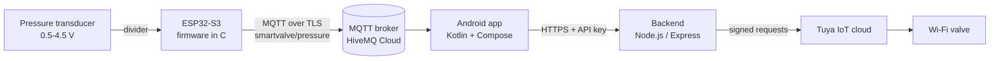

# Smart Valve IoT

Remote pressure monitoring and valve control from an Android phone.

An **ESP32-S3** reads an analog pressure transducer and publishes the value
over **MQTT/TLS**. An **Android app** shows it live and opens or closes a
**Tuya Wi-Fi valve** through a small **Node.js backend** that keeps the
cloud credentials off the phone.

*[Leer en español](README.es.md)*



## Features

- **Firmware in C on ESP-IDF 5.4.** Event-driven Wi-Fi with exponential
  backoff, TLS with broker certificate verification, a Last Will that flags
  the board offline, and calibrated ADC readings (eFuse curve fitting,
  averaging, open-wire and short detection). The sampling loop never
  blocks on the network.
- **Unit-tested conversion math.** The voltage-to-pressure code has no
  hardware dependencies and runs on the host, with ASan and UBSan in CI.
- **Android app in Kotlin + Jetpack Compose.** MVVM with StateFlow, an MQTT
  5 client, Retrofit, a live gauge, and English and Spanish UI. Unit tests
  cover the ViewModel and the JSON contract with the firmware.
- **Backend.** Keeps the Tuya secret on the server, uses constant-time API
  key checks, deploys to Render with one click, and is tested with a fake
  Tuya client.
- **Every credential lives in git-ignored files.** Nothing to scrub before
  you push your fork.

## Repository layout

```
firmware/   ESP-IDF project (C) for the ESP32-S3
  main/       app_main, wifi_sta, pressure_sensor, pressure_math, mqtt_link
  test/       host unit tests (make)
android/    Android Studio project (Kotlin, Jetpack Compose)
backend/    Node.js service between the app and the Tuya cloud
docs/       hardware.md (wiring, calibration) · protocol.md (MQTT + REST)
```

## What you need

| | |
|---|---|
| Hardware | ESP32-S3-DevKitC-1, a 0.5–4.5 V pressure transducer, 1 kΩ + 2 kΩ resistors, a Tuya/Smart Life Wi-Fi valve. See [docs/hardware.md](docs/hardware.md) |
| Accounts (free tiers work) | [HiveMQ Cloud](https://www.hivemq.com/mqtt/cloud-broker/) (or any MQTT broker with TLS), [Tuya IoT Platform](https://iot.tuya.com), [Render](https://render.com) (or any Node host) |
| Software | [ESP-IDF v5.4](https://docs.espressif.com/projects/esp-idf/en/v5.4.2/esp32s3/get-started/index.html), [Android Studio](https://developer.android.com/studio), [Node.js 18+](https://nodejs.org) |

---

## Setup guide

Follow the steps in order: each one produces a value the next one needs.
Keep a text file open to note them down.

### 1. MQTT broker (HiveMQ Cloud)

1. Create a free *Serverless* cluster at <https://console.hivemq.cloud>.
2. In **Overview**, copy the **Cluster URL**
   (`xxxxxxxx.s1.eu.hivemq.cloud`). Port is **8883** (TLS).
3. In **Access Management**, create a user and password with
   *Publish and Subscribe* permission. You can create one user for the
   board and another for the app.

📝 Note down the host, username and password.

### 2. Tuya cloud project

1. Add the valve to the **Smart Life** app on your phone and check that
   you can open and close it from there.
2. At <https://iot.tuya.com>, go to **Cloud → Development → Create Cloud
   Project**. Use *Smart Home* and pick the **data center that matches
   your Smart Life account's region** (for example *Western America* for
   Mexico and the US). A mismatch here is the most common setup error.
3. In the project: **Devices → Link Tuya App Account → Add App Account**,
   then scan the QR code with Smart Life (*Me → scan icon*). The valve now
   appears in the device list.
4. In **Service API**, make sure *IoT Core* is authorized.

📝 Note down the **Access ID** and **Access Secret** (project
*Overview*), the valve's **Device ID**, and the **API endpoint** of your
data center (`https://openapi.tuyaus.com` for Western America).

### 3. Backend

**Run it locally first:**

```bash
cd backend
cp .env.example .env        # then fill in the Tuya values and invent an API_KEY
npm install
npm test                    # 8 tests, no network needed
npm start
```

Generate a strong `API_KEY`:

```bash
node -e "console.log(require('crypto').randomBytes(32).toString('base64url'))"
```

Check it works:

```bash
curl http://localhost:3000/
curl -H "x-api-key: YOUR_API_KEY" http://localhost:3000/valve/functions
```

The second call lists the valve's data points. If the switch is not called
`switch`, set `VALVE_CODE` to the right code (often `switch_1`). Then try:

```bash
curl -X POST -H "x-api-key: YOUR_API_KEY" http://localhost:3000/valve/open
```

**Deploy it (Render):**

1. Push your fork to GitHub.
2. On Render: **New → Blueprint** and pick the repository. It reads
   [`render.yaml`](render.yaml) and asks for `TUYA_ACCESS_ID`,
   `TUYA_ACCESS_SECRET` and `DEVICE_ID`. It also generates a random
   `API_KEY`, which you can see under *Environment*.
3. Adjust `TUYA_ENDPOINT` and `VALVE_CODE` if yours differ.
4. Open `https://<your-service>.onrender.com/`. It should answer
   `{"ok":true,...}`.

> On the free plan the service sleeps after 15 minutes idle, so the first
> request after that takes up to about 50 s.

📝 Note down the backend URL and the `API_KEY`.

### 4. Firmware (ESP32-S3)

1. Install ESP-IDF v5.4 ([official guide](https://docs.espressif.com/projects/esp-idf/en/v5.4.2/esp32s3/get-started/index.html)).
   On Linux or macOS:
   ```bash
   git clone -b v5.4.2 --recursive https://github.com/espressif/esp-idf.git ~/esp/esp-idf
   ~/esp/esp-idf/install.sh esp32s3
   . ~/esp/esp-idf/export.sh          # run this in every new terminal
   ```
2. Wire the sensor as shown in [docs/hardware.md](docs/hardware.md).
3. Configure:
   ```bash
   cd firmware
   idf.py set-target esp32s3
   idf.py menuconfig
   ```
   Open **Smart Valve configuration** and fill in:
   - **Wi-Fi**: SSID and password. The ESP32 only supports 2.4 GHz.
   - **MQTT**: broker URI `mqtts://<cluster-url>:8883`, username and
     password.
   - **Pressure sensor**: keep the defaults for now.

   Press `S` to save and `Q` to quit. Your values go into
   `firmware/sdkconfig`, which is git-ignored.
4. Plug the board into its **USB** port (not *UART*), then build, flash and
   watch the log:
   ```bash
   idf.py build flash monitor          # Ctrl+] to exit the monitor
   ```
   Expected output:
   ```
   I (1234) wifi: got IP 192.168.1.50
   I (2345) mqtt: connected to broker
   I (4321) app: 0.0 psi | 318 mV | raw 402
   ```
5. Calibrate if needed ([docs/hardware.md → Calibration](docs/hardware.md#calibration)).

In the HiveMQ console, **Web Client** tab, subscribe to `smartvalve/#`:
you should see a reading every 2 seconds and `online` on the status topic.

Run the host unit tests (no board needed):

```bash
make -C firmware/test
```

### 5. Android app

1. Open the `android/` folder in Android Studio.
2. Create your credentials file:
   ```bash
   cd android
   cp secrets.properties.example secrets.properties
   ```
   Fill in the MQTT host, username and password (step 1), and the backend
   URL (ending in `/`) and `API_KEY` (step 3).
3. Click **Run ▶** with a phone connected (USB debugging on) or an
   emulator. You can also build from the terminal:
   ```bash
   ./gradlew testDebugUnitTest assembleDebug
   # APK: android/app/build/outputs/apk/debug/app-debug.apk
   ```

The app shows the live pressure, whether the board and sensor are OK, and
the valve state, with **OPEN** and **CLOSE** buttons.

---

## Troubleshooting

| Symptom | Likely cause |
|---|---|
| Log repeats `disconnected (reason 201)` | Wrong SSID, or a 5 GHz-only network |
| `reason 15` or `reason 204` | Wrong Wi-Fi password |
| `broker refused the connection` | Wrong MQTT username or password, or the user lacks publish permission |
| `transport error` right after `got IP` | Broker URI does not start with `mqtts://` or the port is not 8883 |
| `SENSOR FAULT: 20 mV` | Signal wire loose, sensor not powered, or the divider is not connected |
| `SENSOR FAULT: 3300 mV` | Signal shorted to 3.3 V or 5 V: check the wiring before powering again |
| Pressure reads a little above 0 at rest | Recalibrate *zero* ([docs/hardware.md](docs/hardware.md#calibration)) |
| App: "Board offline" | Firmware not running, or app and board use different topics or brokers |
| App: valve buttons return `401` | `backend.apiKey` in the app ≠ `API_KEY` in the backend |
| Backend: `permission deny` or `No permissions` | Wrong Tuya data center, or the Smart Life account is not linked to the cloud project |
| First valve command takes ~50 s | Render free plan waking up |

## Design notes

- **Why the valve does not go through the ESP32.** The valve is an
  off-the-shelf Tuya device with its own Wi-Fi and cloud, so it keeps
  working (and stays controllable) even if the sensor node is offline. The
  ESP32 only measures.
- **Why a backend for the valve.** The Tuya *Access Secret* can control
  every device in the project. Shipping it inside an APK would expose it to
  anyone who unzips the file. The backend holds it, and the app only gets a
  key that you can rotate at any time.
- **Why MQTT for the pressure.** Many subscribers, retained last value, and
  presence detection through the Last Will, at a few bytes per reading.
  HTTP polling would need a public endpoint on the board.
- **Non-blocking by design.** The first prototype of the node connected to
  the broker inside a `while (!connected)` loop in the main loop. When the
  broker was unreachable the board stopped reading the sensor altogether.
  In this version Wi-Fi and MQTT are event-driven and reconnect on their
  own, and a separate FreeRTOS task samples at a fixed rate with
  `vTaskDelayUntil`.

## License

[MIT](LICENSE)
